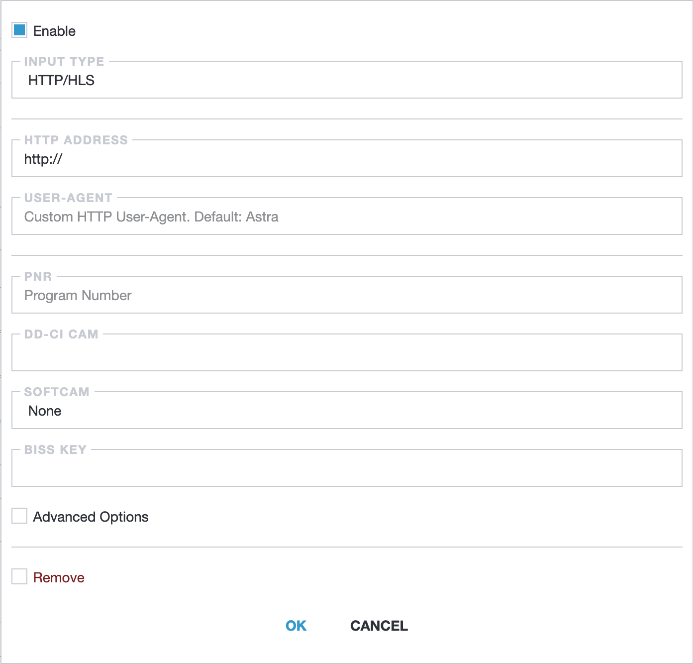

# HTTP MPEG-TS

Receiving stream with a single HTTP request like downloading an infinity file. [Read more](/en/book/protocols/http/)

## Address format

```
http://host
http://host:port/path
http://auth@host:port/path#options
https://auth@host:port/path#options
```

* `auth` – login and password for HTTP authentication. Supports Basic and Digest authentication methods
* `host` – remote server address IPv4 or domain name
* `port` – remote port. Default: **80** for http and **443** for https
* `path` – path to the resource. Default: **/**

Options:

- `pnr=Number` - select program from MPTS (Multi-Program Transport Stream)
- `ua=Name` – custom User-Agent header
- `buffer_time=Seconds` – incoming buffer size in seconds. Default: **3**
- `no_sync` – disables bufferization
- `debug` – log all receiving information: HTTP headers

## Web Interface

In the web interface HTTP Input options available in the Stream options. You can write source address directly to the Input address line:

{: width="400"}

Or click to the gear icon and use an Input configuration form:

{: width="400"}

## Troubleshooting
