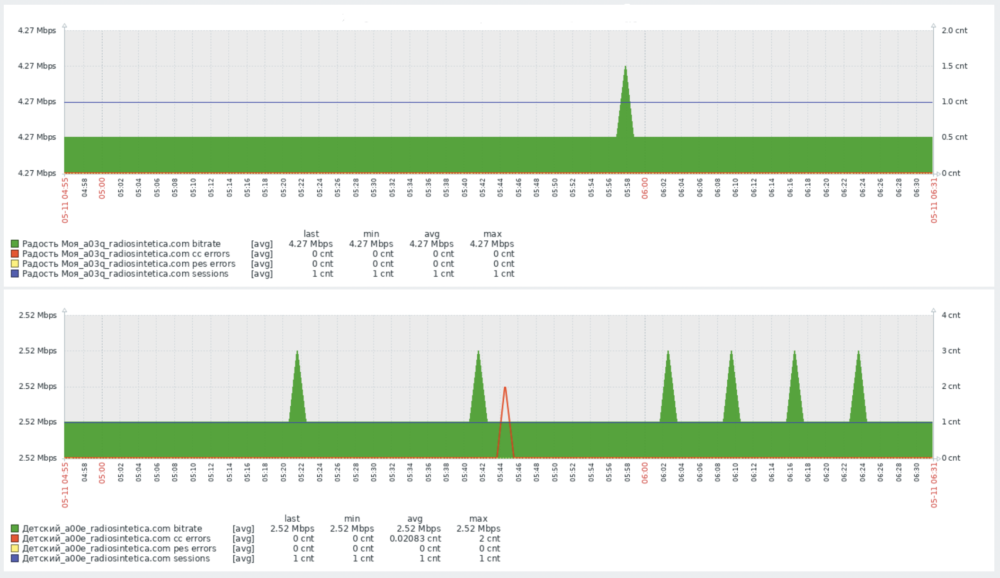

# Zabbix

Astra is a multifunctional software solution, but it is also compatible with other programs

!!! danger "Version"
    Available from: **astra-2021.05.11**

## Zabbix-Server download

Zabbix can be installed both on a dedicated server and on an Astra server

1. Go to [Zabbix.com](https://www.zabbix.com/download){target="_blank"}
2. Select Zabbix version
3. Select your OS
4. Follow the installation instructions

You can find detailed information on the website [Zabbix/manuals](https://www.zabbix.com/manuals){target="_blank"}

## Zabbix-Agent download

If Zabbix-Server is installed on your dedicated server, install Zabbix-Agent on the server where Astra is installed

!!! danger "It is installed on the same server as Astra"
     **Skip this step** if Zabbix-server is installed on the same server as Astra.

1. Go to [Zabbix/agent.com](https://www.zabbix.com/download_agents){target="_blank"}
2. Select your OS
3. Follow the installation instructions

You can find detailed information on the website [Zabbix/agent](https://www.zabbix.com/documentation/current/manual/concepts/agent){target="_blank"}

## Setting up Zabbix-Agent

1. Edit the Agent configuration file: `sudo nano /etc/zabbix/zabbix_agentd.conf`
2. Find the `Server=` option and in it specify the IP or DNS name of the server where Zabbix is installed
3. Save the file (Crtl+O) and exit the editor (Ctrl+X)
4. Download scripts for zabbix-agent: `curl https://cesbo.com/download/astra/zabbix/agent.tar.gz | tar -zxC /opt`
5. The scripts will be saved to the directory `/opt/zabbix_agent`
6. Set permissions: `chmod +x /opt/zabbix_agent/*`
7. Download the configuration file: `curl -o /etc/zabbix/zabbix_agentd.d/astra.conf https://cesbo.com/download/astra/zabbix/astra.conf`
8. Install dependencies:
   - for RedHat-like systems: `yum install python3 python3-requests` 
   - for Debian-like systems: `apt-get install python3 python3-requests`
9. Restart Zabbix-Agent: `service zabbix-agent restart`

## Setting up Astra

1. Open the Astra web interface
2. Go to Settings -> Users
3. Create a user with type Administrator for Zabbix-Agent access to Astra AP

## Setting up Zabbix

1. Download the [Zabbix template](https://cesbo.com/download/astra/zabbix/zbx_astra.xml){target="_blank"} on work computer
2. Open the Zabbix interface: `http://zabbix-server`
3. Go through the authorization procedure: login and password - `Admin`
4. Open Configuration -> Templates
5. In the upper right corner, click the `Import` button
6. Click `Browse` and select the downloaded template: `zbx_astra.xml`
7. Click `Import`. After successful import, you will see a green message `Imported successfully`
8. Go to Configuration -> Templates and select `Astra API monitoring`
9.  Open the `Macros` tab and fill in the `Value`:
    - First line, set password for Zabbix in Astra 
    - Second line, set username for Zabbix to Astra
    - The last line, the port of the Astra web interface. If you have multiple processes, specify all ports separated by commas. For example: `8000,8001,8002`
    - After filling in all the options, click `Update`
10. Open Configuration -> Hosts and click `Create host` in the top right corner
11. Fill in the following fields:
    - `Hostname` - any name of the server where Astra is installed, for example: `Astra`  
    - `Groups` - select `Cesbo_templates` or create a new group
    - `Interfaces` - click `add`, select `Agent`, specify the IP or DNS name of the server with Zabbix-Agent installed
    - Open the `Templates` tab:
      - In the Link new templates field, add `Astra API monitoring`, and if you want to control the general state of the system, add also `Linux by Zabbix agent`
12. Save your changes. After about 10 minutes, you will see graphs and triggers about the status of channels and adapters

## Chart examples

