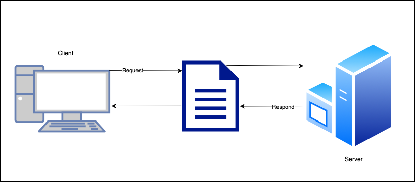
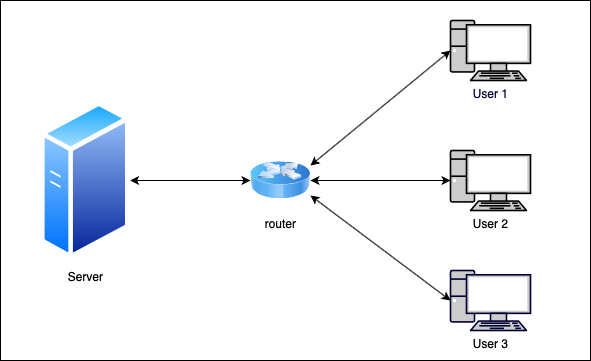

# UDP

UDP (User Datagram  Protocol) - is defined to make available a
datagram  mode of packet-switched computer communication in the environment of an interconnected set of computer networks. 

This protocol provides a procedure for application programs to send messages to other programs with a minimum of protocol mechanism. UDP provides checksums for data integrity, and port numbers for addressing different functions at the source and destination of the datagram.

Detailed description available in the [RFC 768][RFC 768] standard.

A number of UDP's attributes make it especially suited for certain applications:

- It is transaction-oriented, suitable for simple query-response protocols such as the Domain Name System or the Network Time Protocol.
- It provides datagrams, suitable for modeling other protocols such as IP tunneling or remote procedure call and the Network File System.
- It is simple for bootstrapping or other purposes without a full protocol stack, such as the DHCP and Trivial File Transfer Protocol.
The lack of retransmission delays makes it suitable for real-time applications such as Voice over IP, online games, and many protocols using Real Time Streaming Protocol.
- Because it supports multicast, it is suitable for broadcast information such as in many kinds of service discovery and shared information such as Precision Time - Protocol and Routing Information Protocol.
- It is stateless, suitable for very large numbers of clients, such as in streaming media applications such as IPTV.

## IPTV

IPTV (Internet Protocol television) - is the delivery of television content over Internet Protocol (IP) networks. IPTV offers the ability to stream the source media continuously. As a result, a client media player can begin playing the content (such as a TV channel) almost immediately. This is known as streaming media.

IPTV is widely deployed in subscriber-based telecommunications networks with high-speed access channels into end-user premises via set-top boxes or other customer-premises equipment. IPTV is also used for media delivery around corporate and private networks.

IPTV is defined as the secure and reliable delivery to subscribers of entertainment video and related services. These services may include Live TV, VOD (Video On Demand) and iTV  (Interactive TV). Playback requires a device connected to either a fixed or wireless IP network in the form of a standalone personal computer, smartphone, touch screen tablet, game console, connected TV or set-top box. Content is compressed by Video and audio codecs and then encapsulated in MPEG transport stream or Real-time Transport Protocol or other packets. IP multicasting allows for live data to be sent to multiple receivers using a single multicast group address.

### Architecture of a video server network

Depending on the network architecture of the service provider, there are two main types of video server architecture that can be considered for IPTV deployment: centralised and distributed.

> The centralised architecture model is a relatively simple and easy to manage solution. Because all media content is stored in centralised servers, it does not require a comprehensive content distribution system. Centralised architecture is generally good for a network that provides relatively small VOD service deployment, has adequate core and edge bandwidth or has an efficient content delivery network (CDN).

> A distributed architecture has bandwidth usage advantages and inherent system management features that are essential for managing a larger server network. Distributed architecture requires intelligent and sophisticated content distribution technologies to augment effective delivery of multimedia contents over the service provider's network.

## Multicast

In computer networking, multicast is group communication where data transmission is addressed to a group of destination computers simultaneously. Multicast can be one-to-many or many-to-many distribution.

Group communication may either be application layer multicast or network-assisted multicast, where the latter makes it possible for the source to efficiently send to the group in a single transmission. Copies are automatically created in other network elements, such as routers, switches and cellular network base stations, but only to network segments that currently contain members of the group. Network assisted multicast may be implemented at the data link layer using one-to-many addressing and switching such as Ethernet multicast addressing, ATM (Asynchronous Transfer Mode), P2MP (point-to-multipoint virtual circuits) or InfiniBand multicast. Network-assisted multicast may also be implemented at the Internet layer using IP multicast. In IP multicast the implementation of the multicast concept occurs at the IP routing level, where routers create optimal distribution paths for datagrams sent to a multicast destination address.

Multicast is often employed in Internet Protocol (IP) applications of streaming media, such as IPTV and multipoint video conferencing.

[RFC 768]: https://www.rfc-editor.org/rfc/rfc768